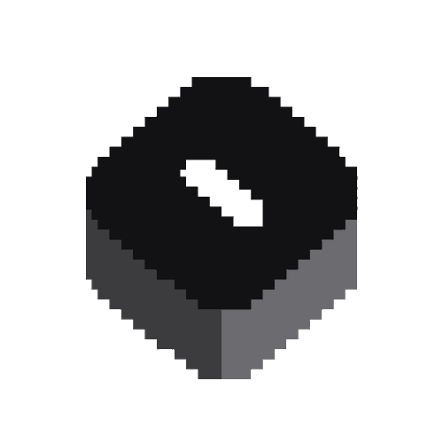

Building and playing with interesting problems. Nanlabs is a collection of experiments.

Tools, runtimes, libraries and developer experiences, exploring what's new and honing the craft of how they're presented to people who use them.
